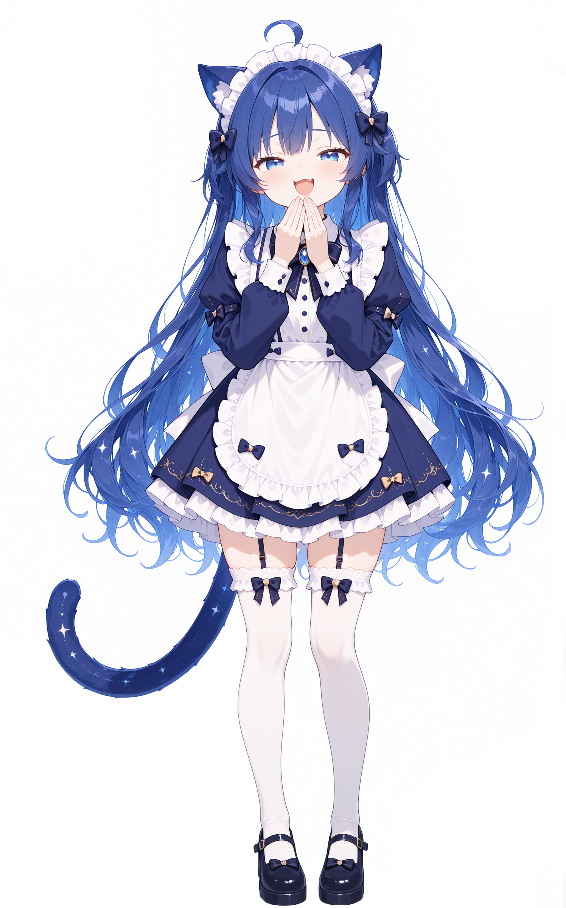

# CS2 饰品抽奖模拟器

> 一个用 C# WinForms 写的 **CS2 饰品抽奖模拟器**。
> 奖池按真实市场价定价（2026.9.21在成交量非常少的饰品会出现不合理的价格可以给我说一下）、滚动动画同步音乐、出货限时回收、仓库汰换、答题赚金币。
> 题目很有意思，还有小猿口算玩（？）
> **纯娱乐用途。金币与饰品均为虚拟，不涉及真实货币或真实交易。**



---

## ⚠️ 免责声明

- 本项目是**非官方粉丝作品**，与 **Valve Corporation 无任何关联**，
- 目的是劝诫赌博行为（真的假的）
  未获得 Valve 的授权、赞助或认可。Counter-Strike 是 Valve Corporation 的商标。
- **仓库不包含任何 CS2 游戏素材。** 饰品贴图著作权属于 Valve，
  请勿再分发或商用。程序运行需要的图片由使用者**自行准备**（见下文）。
- 价格数据来自第三方市场平台，仅供模拟演示，**不构成任何投资建议**。
- 详见 [THIRD_PARTY.md](THIRD_PARTY.md)。

---

## 功能

| 模块 | 说明 |
|---|---|
| **奖池** | 60+ 个池子：按武器类型分类，匕首池 / 手套池独立；单抽成本 = 池内均价 × 120% |
| **奇迹池** | 4 个特殊池：少量极品 + 一个便宜保底，极品概率 2%，回报率仍为 75% |
| **抽奖动画** | 滚动卷轴，10 秒，音乐与动画**共用同一时间原点**（实测偏差 47ms） |
| **五连抽** | 5 个卷轴错峰启动（每 1 秒延迟）、**同时结束**；任一为前 20% 即触发金光 |
| **出货回收** | 抽完弹「限时高价回收」，市价 ×95%（仓库常规 ×90%，**高 5%**），限时 5 秒 |
| **仓库与汰换** | 一键回收（市价 90%）；汰换 48% 成功 → 换成 1.7~2.3 倍价值的随机饰品 |
| **赚金币** | 比大小（0.25 秒换题，连对叠加最高 250） / 游戏知识题库（答对 1500） / 休息奖励（3 分钟 +10000） |
| **音乐音效** | **全部由代码合成波形**，10 首转动音乐 × 2 种音色包，不内嵌任何第三方音频 |
| **界面** | 蓝黑主题，立绘 + 数据不遮挡；低金币时雌小鬼语气（这谁绷的住）劝诫弹窗 |

---

## 目录结构

```
cs2-roulette/
├── src/                     C# 源码（12 个文件，无第三方依赖）
│   ├── Program.cs           入口与命令行参数
│   ├── MainForm.cs          主窗体、抽奖流程、回收/汰换、答题
│   ├── Ui.cs                自绘控件：池子卡片、滚动卷轴、按钮
│   ├── Items.cs             物品数据库与奖池构建
│   ├── Music.cs             转动音乐（波形合成）
│   ├── SoundFx.cs           原版音效
│   ├── DeltaSfx.cs          三角洲风格音效
│   ├── Game.cs              Wallet / Inventory / 比大小题
│   ├── GameBank.cs          题库加载
│   ├── Json.cs              手写 JSON 解析器
│   ├── NeonButton.cs        霓虹按钮控件
│   └── Colors.cs            配色工具
├── tools/                   数据抓取与加工
├── assets/                  立绘与背景（自制）
├── data/quiz.txt            游戏知识题库（232 道）
├── build.ps1                编译 + 部署
└── build_items.py           由皮肤元数据生成 data/items.json 与 images/
```

---

## 从源码构建

**无需 .NET SDK** —— 直接用 Windows 自带的 C# 编译器。

### 1. 准备图片素材（必须，仓库未包含）

程序运行需要 CS2 饰品贴图，但**仓库不提供**（版权原因）。请自行准备：

1. 获取一份 CS2 皮肤素材（含中文名 PNG 与 `manifest.json` 元数据）
2. 把原图放进项目根目录的 `cs2-skins/`
3. 把元数据放成 `manifest.json`、`skins.json`、`skins-zh.json`

然后运行：

```powershell
python build_items.py
```

它会：
- 读取元数据，按**磨损 float 区间求交集**判断哪些磨损真实存在
  （例如多普勒只有崭新/略磨；AWP 二西莫夫没有崭新）
- 原皮刀（无涂装）只生成 **1 条**，不重复 5 份
- 用**英文名**生成扁平图片名，并校验「一张图只对应一个皮肤」

> 早期版本用中文名做文件名，而脚本只保留 `[a-z0-9]`，
> 中文被删光后退化成 `ddpat.png`、`.png`，导致大量图片互相覆盖、道具与图片错配。
> 现已修正，并加了碰撞校验（当前碰撞数 0）。

### 2. 准备价格数据（可选）

没有价格数据也能跑，程序会用稀有度兜底估价。想要真实价格：

```powershell
python tools/run_fetch_all.py          # 抓取挂单价与成交记录
python tools/match_transactions.py --rate 7.0   # 生成 prices.json 与 excluded.json
```

> **注意**：抓取需遵守目标平台的服务条款，**频率务必克制**。
> 脚本设计为低并发 + 带 cookie 直连 HTTP，请勿改成高并发。

### 3. 编译

```powershell
powershell -ExecutionPolicy Bypass -File build.ps1
```

产物：`release\CS2Roulette.exe`（约 110 KB）

---

## 界面与主题

主题色**实测自立绘取色**：

| 色值 | 用途 |
|---|---|
| `#3C3C78` 藏蓝 | 卡片 / 面板底 |
| `#4884F0` 亮蓝 | 主强调色 |
| `#242454` 深蓝 | 渐变暗部 |
| `#F2C454` 金 | 金币相关 |

全部颜色集中在 `src/Ui.cs` 的 **`Theme`** 类，改配色只改这一个类。

> 稀有度色（消费级 ~ 违禁）保持 CS2 官方配色未改。

---

## 命令行参数（便于自动化测试）

| 参数 | 作用 |
|---|---|
| `--autodraw` | 启动后自动抽一次 |
| `--drawcount N` | 自动抽 N 次（5 表示五连抽） |
| `--poolkey KEY` | 指定奖池（如 `m:ultra`、`c:knife`、`s:all`） |
| `--benchdraw` | 输出测试日志到 stdout |
| `--pooldump` | 打印全部奖池统计 |
| `--testquiz N` | 自动答题 N 道（**负值 = 故意答错**，用于验证答错路径） |
| `--testcmp N` | 自动答 N 道比大小 |
| `--testtrade N` | 汰换压力测试 N 次，输出成功率与倍率分布 |
| `--testcd` | 自动领一次休息奖励 |
| `--coins N` | 指定初始金币 |
| `--tab N` | 启动时切到第 N 页 |

---

## 技术要点

- **不依赖任何第三方库**：JSON 解析器、音频合成、自绘控件全部手写
- **动画用挂钟驱动**（`Stopwatch`）而非累加步长：
  WinForms Timer 实际间隔远大于设定值，累加会把 10 秒动画拖到 16 秒以上
- **音乐与动画共用时间原点**：音乐启动的那一刻记录时刻，所有卷轴以此为起点
- **先入仓再播动画**：扣金币后立即写入仓库，避免动画期间退出导致「扣钱拿不到东西」
- **点击穿透**：立绘用 `Dock` 参与布局而非浮在控件之上，不遮挡任何交互

---

## 许可

代码以 [MIT License](LICENSE) 开源。

**但请注意**：MIT 仅覆盖本仓库的代码与文档。
若你自行放入 CS2 游戏素材，其著作权归 Valve 所有，**不受本许可授权**。

---

## 贡献

欢迎提 Issue 与 PR。若涉及素材，请注意：

- **不要提交任何 Valve 版权图片**
- **不要提交任何含 cookie / 个人凭据的文件**
- 新增题库请遵循 `data/quiz.txt` 的格式（`分类|题干|选项A-D|正确序号|解析`）
